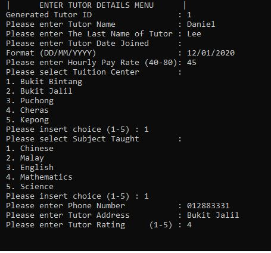

<!--
*** You are not suppose to be here but okay.
*** This is a reference to another Github readme temple
*** https://github.com/othneildrew/Best-README-Template/blob/master/README.md
*** Basically that's all I want to say. Good Luck and have fun. 
-->

# Data Structure Examples using linked list and dynamic
Year 2 Sem 2 Assignment

[![Contributors][contributors-shield]][contributors-url]
[![Forks][forks-shield]][forks-url]
[![Issues][issues-shield]][issues-url]
[![MIT License][license-shield]][license-url]
[![LinkedIn][linkedin-shield]][linkedin-url]

<!--------------------------------------------------------------------- THIS IS SEPERATION LINE-------------------------------------------------------------------->

<!-- PROJECT LOGO -->
<br />
<p align="center">
  <a href="https://github.com/kin9787/Data-Structure-Assignment">
    
  </a>
  
  <h3 align="center">Data Structure Examples</h3>

  <p align="center">
   Two data structure examples built in C++
    <br />
    <a href="https://github.com/kin9787/Data-Structure-Assignment"><strong>Explore the docs »</strong></a>
    <br />
    <a href="https://github.com/kin9787/Data-Structure-Assignment/issues">Report Bug</a>
    ·
    <a href="https://github.com/kin9787/Data-Structure-Assignment/issues">Request Feature</a>
  </p>
</p>

<!--------------------------------------------------------------------- THIS IS SEPERATION LINE-------------------------------------------------------------------->

<!-- TABLE OF CONTENTS -->
<details open="open">
  <summary>Table of Contents</summary>
  <ol>
    <li>
      <a href="#about-the-project">About The Project</a>
      <ul>
        <li><a href="#built-with">Built With</a></li>
      </ul>
    </li>
    <li>
      <a href="#getting-started">Getting Started</a>
      <ul>
        <li><a href="#prerequisites">Prerequisites</a></li>
        <li><a href="#installation">Installation</a></li>
      </ul>
    </li>
    <li><a href="#usage">Usage</a></li>
    <li><a href="#roadmap">Roadmap</a></li>
    <li><a href="#license">License</a></li>
    <li><a href="#contact">Contact</a></li>
    <li><a href="#acknowledgements">Acknowledgements</a></li>
  </ol>
</details>

<!--------------------------------------------------------------------- THIS IS SEPERATION LINE-------------------------------------------------------------------->

<!-- ABOUT THE PROJECT -->
## About The Project
<p align="center">
    
</p>

<!-- [![Product Screen Shot][product-screenshot]](https://github.com/kin9787/Data-Structure-Assignment/blob/master/images/DataStructureExample.JPG) -->

This project is a university assignment. Two data structure are to be created using C++. One using linked list, one using dynamic.

Some useful reference and resoucrs that I find helpful are listed in the acknowledgements.

<!--------------------------------------------------------------------- THIS IS SEPERATION LINE-------------------------------------------------------------------->

 <!-- Built With -->
### Built With

The system is build in IDE using just C++.
* [C++](https://docs.microsoft.com/en-us/cpp/?view=msvc-160)

<!--------------------------------------------------------------------- THIS IS SEPERATION LINE-------------------------------------------------------------------->

<!-- GETTING STARTED -->
## Getting Started

To get a local copy follow the simple steps in the [installation](#installation) section.

<!--------------------------------------------------------------------- THIS IS SEPERATION LINE-------------------------------------------------------------------->

### Prerequisites

You just need [C++](https://docs.microsoft.com/en-us/cpp/?view=msvc-160). IDE is recommended such as [Visual Studio](https://visualstudio.microsoft.com/).
> ⚠️For this project, use VS studio 2017 or older. Later version will cause conflicts.

<!--------------------------------------------------------------------- THIS IS SEPERATION LINE-------------------------------------------------------------------->

### Installation

1. Clone the repo
   ```sh
   git clone https://github.com/kin9787/Data-Structure-Assignment.git
   ```
2. Within the folder, summon the terminal run the file.

<!--------------------------------------------------------------------- THIS IS SEPERATION LINE-------------------------------------------------------------------->

<!-- USAGE EXAMPLES -->
## Usage

This repo acts as a reference to those who want to try to built something using Python. 

_For more examples, please refer to the author by contact him_

<!--------------------------------------------------------------------- THIS IS SEPERATION LINE-------------------------------------------------------------------->

<!-- ROADMAP -->
## Roadmap

See the [open issues](https://github.com/kin9787/Data-Structure-Assignment/issues) for a list of proposed features (and known issues).
   
<!--------------------------------------------------------------------- THIS IS SEPERATION LINE-------------------------------------------------------------------->   

<!-- LICENSE -->
## License

Distributed under... myself. See `LICENSE` for more information.

<!--------------------------------------------------------------------- THIS IS SEPERATION LINE-------------------------------------------------------------------->

<!-- CONTACT -->
## Contact

Your Name - Chen Chee Kin

Email - chencheekin1234@gmail.com

Project Link: [https://github.com/kin9787/Data-Structure-Assignment](https://github.com/kin9787/Data-Structure-Assignment)

<!--------------------------------------------------------------------- THIS IS SEPERATION LINE-------------------------------------------------------------------->

<!-- MARKDOWN LINKS & IMAGES -->
<!-- https://www.markdownguide.org/basic-syntax/#reference-style-links -->
[contributors-shield]: https://img.shields.io/github/contributors/kin9787/kin9787.svg?style=for-the-badge
[contributors-url]: https://github.com/kin9787/Data-Structure-Assignment/graphs/contributors
[forks-shield]: https://img.shields.io/github/forks/kin9787/kin9787.svg?style=for-the-badge
[forks-url]: https://github.com/kin9787/Data-Structure-Assignment/network/members
[issues-shield]: https://img.shields.io/github/issues/kin9787/kin9787.svg?style=for-the-badge
[issues-url]: https://github.com/kin9787/Data-Structure-Assignment/issues
[license-shield]: https://img.shields.io/github/license/kin9787/kin9787.svg?style=for-the-badge
[license-url]: https://github.com/kin9787/Data-Structure-Assignment/blob/master/LICENSE.txt
[linkedin-shield]: https://img.shields.io/badge/-LinkedIn-black.svg?style=for-the-badge&logo=linkedin&colorB=555
[linkedin-url]: https://www.linkedin.com/in/chen-chee-kin-2b6664157/
<!-- [product-screenshot]: images/DataStructureExample.JPG -->

<!--------------------------------------------------------------------- THIS IS SEPERATION LINE-------------------------------------------------------------------->

<!-- ACKNOWLEDGEMENTS -->
## Acknowledgements
📓 If you cannot access/asked to login before reading further, access the link using incognito mode.
<br></br>Well it's a school project so the lecturers are to thank here.
